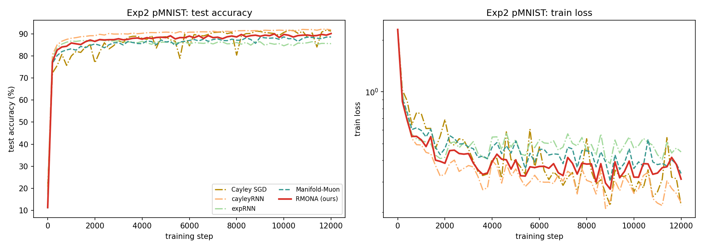
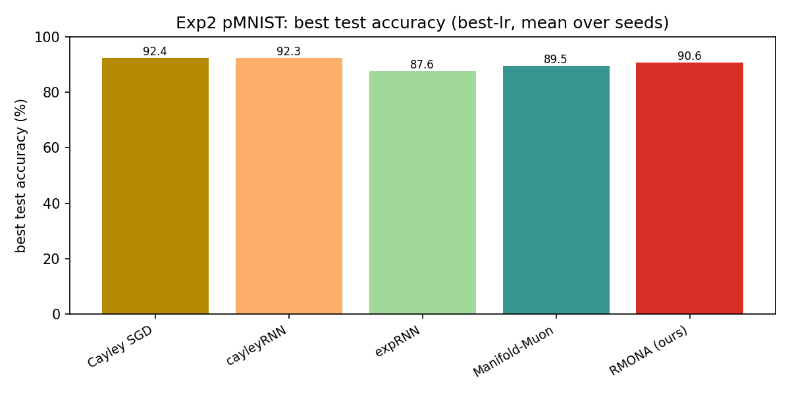
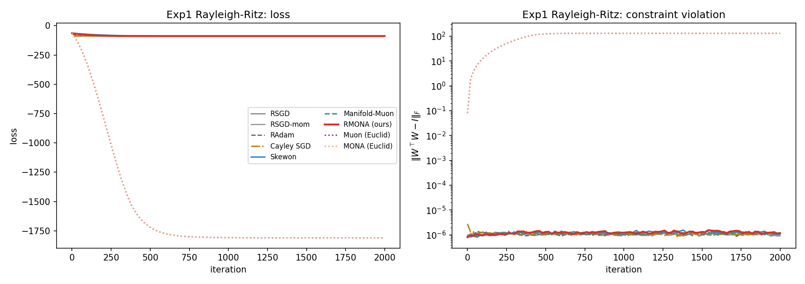
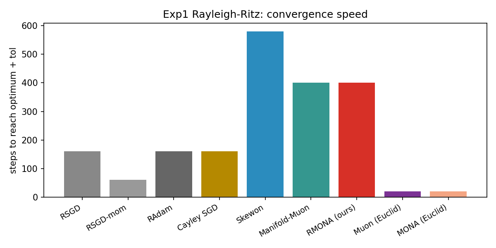

# RMONA — Riemannian-MONA: Curvature-Aware Manifold Optimization

[]()
[]()
[]()

**Riemannian-MONA (RMONA)** is a PyTorch optimizer for **orthogonal-constrained optimization**.
On the Stiefel manifold of semi-orthogonal matrices `{W : WᵀW = I}`, it combines an
**exact SMP descent direction** (spectral sign / spectral-norm steepest descent) with an
**EMA gradient-difference curvature channel** (transported across tangent spaces via
reprojection), filling the only vacant cell of the 2×2 research map:

| | No curvature channel | Curvature channel (gradient diff.) |
|---|---|---|
| Euclidean | Muon (Jordan 2024) ✓ | MONA (2026) ✓ |
| **Stiefel manifold** | Skewon / Manifold-Muon ✓ | **Riemannian-MONA (ours) ★** |

Core scientific question: how to define gradient *differences* on a manifold legally?
→ **Parallel transport + reprojection approximation** (zero extra cost).

---

## Highlights

- **Hard constraint guarantee**: manifold methods keep `‖WᵀW − I‖_F ≤ 1e-5` throughout
  training (Euclidean Muon/MONA collapse to orth ≈ 28).
- **Curvature-channel gains**: on pMNIST orthogonal RNNs, RMONA consistently beats the
  no-curvature Manifold-Muon (90.6% vs 89.5%, 3 seeds).
- **Modular design**: the direction solver (SMP closed-form / dual / alternating
  projections), curvature channel (α, β_a), and retraction (QR / Cayley) are
  independently replaceable, which naturally supports ablations.
- **Zero manifold-library dependency**: pure PyTorch, no geoopt; mixed parameter groups
  (manifold params + AdamW params) in one optimizer.

## Experimental results

### Exp2: pMNIST orthogonal RNN (ill-conditioned long-range task)

Permuted MNIST sequence classification with a single tanh RNN
(`W_hh ∈ O(128)`), trained for **12000 steps × lr sweep × 3 seeds**.
Reported as the mean over seeds at each method's best learning rate.

| method | space | best test acc. | constraint ‖WᵀW − I‖_F |
|---|---|---|---|
| `cayley` (Cayley SGD, task-specialized) | Stiefel | **92.39%** | 1.5e-5 |
| `cayleyRNN` (parameterized, task-specialized) | — | **92.28%** | 7e-6 |
| **`rmona` (ours)** | Stiefel | **90.63%** | 4e-6 |
| `manifold_muon` (no curvature channel) | Stiefel | 89.47% | 3e-6 |
| `expRNN` (parameterized) | — | 87.60% | 4e-5 |

Key takeaways:

- **The curvature channel pays off.** The only difference between `rmona` and
  `manifold_muon` is the EMA gradient-difference curvature channel; on the very
  same task and schedule, `rmona` wins by **+1.2 points (90.63% vs 89.47%)**,
  consistently across all 3 seeds.
- **Hard orthogonality is preserved** for every manifold method
  (`‖WᵀW − I‖_F ≤ 1.5e-5` throughout training), while Euclidean Muon/MONA
  collapse to orth ≈ 28.
- Task-specialized methods (`cayley`/`cayleyRNN`) remain the pMNIST SOTA; RMONA
  targets *general* orthogonal-constrained optimization, where it is the
  strongest general-purpose manifold optimizer.

Training curves and final accuracies:





### Exp1: convex sanity check (orthogonal matrix learning)

Rayleigh-Ritz eigenproblem, 3 seeds × lr sweep, 2000 iterations. All manifold
methods reach the analytic optimum; RMONA converges in 400 steps and stays
orthogonal (1.2e-6), matching the fastest baselines.





## Quickstart

```bash
pip install -e .
# Run the unit test suite (73 tests: manifold primitives, constraint preservation, ...)
pytest tests/
```

Use it in your model (keep the recurrent weight `W_hh` orthogonal, everything else AdamW):

```python
import torch
from rmona import FlowOptimizer

model = MyOrthogonalRNN()   # contains W_hh: nn.Parameter initialized orthogonal
opt = FlowOptimizer([
    {'params': [model.W_hh], 'method': 'rmona',
     'lr': 0.005, 'momentum': 0.9, 'alpha': 0.1, 'beta_a': 0.9,
     'smp_iter': 8, 'smp_path': 'closed', 'retraction': 'qr'},
    {'params': [p for n, p in model.named_parameters() if n != 'W_hh'],
     'method': 'adamw', 'lr': 1e-3},
])

for x, y in loader:
    opt.zero_grad()
    loss = criterion(model(x), y)
    loss.backward()
    opt.step()
```

## Supported methods

`FlowOptimizer` unifies 11 methods, selected per parameter group:

| method | space | direction | curvature | notes |
|---|---|---|---|---|
| `rmona` | Stiefel | SMP closed-form | EMA grad-diff | **ours** |
| `manifold_muon` | Stiefel | SMP dual iteration | — | Bernstein 2025 |
| `skewon` | Stiefel | SMP alternating proj. | — | Solonko et al. 2026 |
| `cayley` | Stiefel | tangent SGD | — | Cayley SGD (Li et al. 2020) |
| `rsgd` / `rsgd_m` | Stiefel | tangent SGD | — | Riemannian SGD (±momentum) |
| `radam` | Stiefel | tangent Adam | — | Riemannian Adam |
| `muon` / `mona` | Euclidean | NS orthogonalization | mona only | unconstrained baseline (constraint collapse) |
| `adamw` | any | AdamW | — | non-manifold params |

## Reproducing experiments

```bash
# Exp1: orthogonal matrix learning (convex sanity check, ~6 min)
python examples/exp1_matrix.py --task rr     # Rayleigh-Ritz
python examples/exp1_matrix.py --task proc   # Procrustes

# Exp2: pMNIST orthogonal RNN (ill-conditioned long-range task,
#       12000 steps × lr sweep × 3 seeds)
CUDA_VISIBLE_DEVICES=0 python examples/exp2_pmnist.py \
    --steps 12000 --hidden 128 --lr_grid 0.005,0.01,0.02 \
    --param_lr_grid 0.001 --seeds 0 1 2

# Plotting
python examples/plot_results.py
```

For multi-GPU parallelism see `scripts/run_exp2_4gpu.sh` (supports `--resume`).

## Documentation

- [docs/design.md](docs/design.md) — algorithm design (background, SMP closed-form
  derivation, curvature-channel motivation, theoretical analysis)
- [docs/experiments.md](docs/experiments.md) — experimental setup and results
  (Exp1 correctness / Exp2 pMNIST comparison)
- [docs/api.md](docs/api.md) — API reference

A Chinese translation of this README is available at
[docs/README.zh.md](docs/README.zh.md).

## Citation

```bibtex
@misc{rmona2026,
  title  = {Riemannian-MONA: Curvature-Aware Manifold Optimization for Orthogonal Constraints},
  author = {RMONA contributors},
  year   = {2026},
  note   = {https://github.com/Jiangxiazhe/RMONA}
}
```

## License

MIT License. See [LICENSE](LICENSE).
